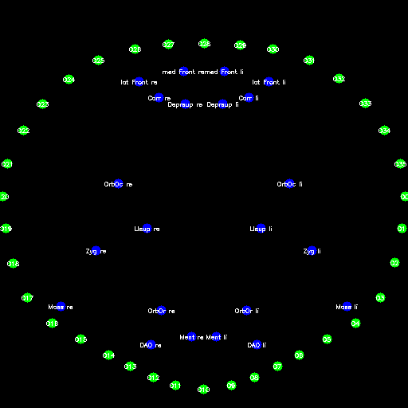
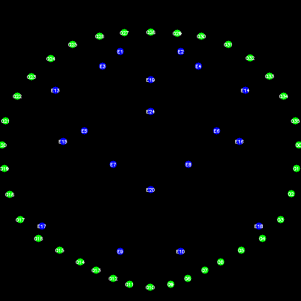

# electromyogram

This is a small python package to create a Electromyogram (EMG) plots for facial muscles.
The current focus is on the solely facial muscles but it could be extended to other muscles, but this is not planned yet.

We currently support the two following schematics for acquiring the EMG data:

- Fridlund and Cappacio () []
- Kuramoto et al. () []

## Installation

Currently the package is not available on PyPI.
Thus, you have to install it from the source code.
If you want to use the package in a virtual environment, you have to activate it first.
Clone this repository and install it with pip:

```bash
git clone <link to this repository>
cd electromyogram
pip install .
```

It is then available in your python environment, and you can import it with:

```python
import electromyogram
```

## Usage

We predefined the two schematics (Fridlund and Cappacio and Kuramoto et al.) on a 2D canvas.
This canvas is based on the canonical face model used by Google in several of their projects (dominantly in *mediapipe*).
All EMG sensor coordinates are given relatively to this canvas thus arbitrary canvas scaling is possible.
We default to a canvas size of 4096x4096 pixels.

The current process for electromyogram visualization is based on a 2 step method.
First, we create the interpolation of the given EMG values on a 2D canvas for the chosen schematic.
Second, we allow the application of different color maps to the interpolation to create the final plot.

### Example 1: Fridlund and Cappacio

Our first example is based on the Fridlund and Cappacio schematic.
We assume that the data is given in a dictionary and the keys are the sensor locations.
Note: We only support a subset of the sensors in the Fridlund and Cappacio schematic. (TODO add list of supported sensors)

The following locations are expected and then interpolated:


```python
import electromyogram as emg

# we assume that the data is given in a dictionary and the keys are the sensor locations
data_values = dict(...)

# create the interpolation
interpo = emg.interpolate(emg.Fridlund, data_values)
myogram = emg.colorize(interpo, cmap='viridis')
```

### Example 2: Kuramoto et al.
Our second example is based on the Kuramoto et al. schematic.
We assume that the data is given in a dictionary and the keys are the sensor locations.
Note: We only support a subset of the sensors in the Kuramoto et al. schematic. (TODO add list of supported sensors)

The following locations are expected and then interpolated:


```python
import electromyogram as emg

# we assume that the data is given in a dictionary and the keys are the sensor locations
data_values = dict(...)
# create the interpolation
interpo = emg.interpolate(emg.Kuramoto, data_values)
myogram = emg.colorize(interpo, cmap='viridis')
```

## Todos

- [ ] Handle if not all values are given for a schematic better
- [ ] Add result images
## License


## References


## Acknowledgements
