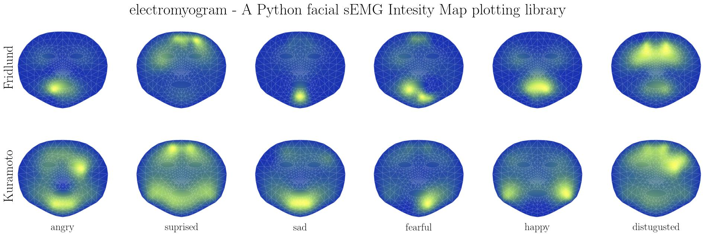

# electromyogram



This Python package provides a convenient way to create an Electromyogram (EMG) Intensity plot specifically designed for facial muscles with facial structure. With this tool, you can visualize and analyze the intensity of EMG data collected from various facial muscles.

A small demo is hosted [here](https://semg.inf-cv.uni-jena.de/), together with the tool [face-projection](https://github.com/cvjena/face-projection) for a projection onto the face.

## Why use sEMG Intensity Plot?

- **Easy to use**: The package provides a straightforward interface, making it accessible for users of all levels of expertise.
- **Visualize muscle activity**: The EMG Intensity plot allows you to visualize the intensity of muscle activity over the face, providing insights into patterns and variations.
- **Designed explicitly for facial muscles**: The tool focuses on facial muscles, enabling you to study and understand muscle activity in the face, which can be particularly useful in fields like facial expression analysis, neuroscience, and rehabilitation.
- **FACS**: Visualize the Facial Action Coding System at the correct anatomical locations for a more intuitive understanding of the data.
- **Blend Shapes**: Many existing blend shape models base their movements on the FACS. We provide a location mapping for commonly used blend shapes models and where they are located on the face to the AU muscle.
- **Potential for extension**: While the current focus is on facial muscles, this tool could potentially be extended to analyze other muscle groups.
- **Beyond muscles**: The tool can also be used to plot additional facial information, such as oxygen saturation, but this is not officially supported yet.


## Installation

The package is available on [PyPI](https://pypi.org/project/electromyogram/) and can be installed with `pip`:
  
```bash
pip install electromyogram
```

If you want to install it locally to add changes, please close the repository and install it with `pip` in development mode.
We assume you already created a virtual environment and activated it :)

```bash
git clone <link to this repository>
cd electromyogram
pip install -e .
```

## Quickstart

This tool is intended to simplify the creation of only the spatial intensity map for surface EMG data.
All the required preprocessing of the data is not part of this package and is likely project-specific.
We assume that the data is given in a dictionary (or pandas table) and the keys are the sensor locations.

Then, the correct physical interpolation between the sensors is done, and the result is a 2D array of the interpolated values on the canonical face model.
You can then apply different color maps to the interpolation to create the final plot.
We provide detailed examples in `examples/`.


```python
import electromyogram as emg

# we assume that the data is given in a dictionary and the keys are the sensor locations
data_values = dict(...)

scheme = emg.Fridlund()  # or emg.Kuramoto()
# create the interpolation
powermap = emg.interpolate(scheme, data_values, shape=(1024, 1024))
powermap = emg.colorize(powermap, cmap='viridis')
```

For the colorization, the users can use any color map from [matplotlib](https://matplotlib.org/stable/tutorials/colors/colormaps.html) or [pallettable](https://jiffyclub.github.io/palettable/) (e.g., `pallettable.scientific.sequential.Imola_20`)


## Surface EMG Schematics

We currently support the two following schematics for acquiring the EMG data.
If you want to have your own, please open an issue or create a pull request, and we will be happy to add it.

| [Fridlund and Cappacio, 1986](https://pubmed.ncbi.nlm.nih.gov/3809364/) | [Kuramoto et al., 2019](https://onlinelibrary.wiley.com/doi/10.1002/npr2.12059)|
| :---: | :---: |
|   |   |
| [Ekman and Friesen - FACS](https://psycnet.apa.org/record/1971-07999-001)| [Mediapipe Blendshapes](https://storage.googleapis.com/mediapipe-assets/Model%20Card%20Blendshape%20V2.pdf)|
|  |  |

If you want to define your custom scheme, create a new class inherited from `emg.Schematic` and implement the `locations` member. If you support the mirroring of the face, implement the `pairs_L` and `pairs_R` members.
Then, use it in the `interpolate` function, and you are good to go.

## Todos

- [X] Handle if not all values are given for a better schematic
- [X] Add result images
- [X] Add a function to draw triangulation onto the 2D canvas
- [X] Add a function to draw sensor locations onto the 2D canvas
- [X] Add the option to remove the area outside the canonical face model
- [X] Make a better interface for the channel names (mapping to defined terms)
- [ ] Add function to create the according colorbar for matplotlib in the correct size

## License

MIT License

## Citation

If you use our work, please cite us:

```bibtex
under publication, please wait a bit :)
```
